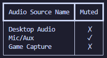
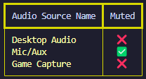

# slobs-cli

[](https://pdm-project.org)
[](https://github.com/astral-sh/ruff)


A command line interface for the Streamlabs Desktop websocket API.

For an outline of past/future changes refer to: [CHANGELOG](CHANGELOG.md)

-----

## Table of Contents

- [Installation](#installation)
- [Configuration](#configuration)
- [Style](#style)
- [Commands](#commands)
- [License](#license)

## Requirements

-   Python 3.11 or greater
-   [Streamlabs Desktop][sl-desktop]
-   A websocket token: Settings > Remote Control > API Token

## Installation

##### *with uv*

```console
uv tool install slobs-cli
```

##### *with pipx*

```console
pipx install slobs-cli
```

The CLI should now be discoverable as `slobs-cli`

## Configuration

#### Flags

-   --domain/-d: Streamlabs client domain
-   --port/-p Streamlabs client port
-   --token/-t: API Token
-   --version/-v: Print the slobs-cli version

Pass `--domain`, `--port` and `--token` as flags on the root command, for example:

```console
slobs-cli --domain localhost --port 59650 --token <API token> --help
```

#### Environment Variables

Load the following values from your environment:

```env
SLOBS_DOMAIN=localhost
SLOBS_PORT=59650
SLOBS_TOKEN=<API Token>
```

Flags can be used to override environment variables.

[sl-desktop]: https://streamlabs.com/streamlabs-live-streaming-software?srsltid=AfmBOopnswGBgEyvVSi2DIc_vsGovKn2HQZyLw1Cg6LEo51OJhONXnAX

## Style

Styling is opt-in, by default you will get a colourless output:



You may enable styling with the --style/-s flag:

```console
slobs-cli --style="yellow" audio list
```

Available styles: _red, magenta, purple, blue, cyan, green, yellow, orange, white, grey, navy, black_



Optionally you may disable border colouring with the --no-border flag:


```console
slobs-cli --style="yellow" --no-border audio list
```

Or with environment variables:

```env
SLOBS_STYLE=yellow
SLOBS_STYLE_NO_BORDER=true
```

## Commands

#### Scene

-   list: List all available scenes.
    -   flags:

        *optional*
        -   --id: Include scene IDs in the output.

```console
slobs-cli scene list
```

-   current: Show the currently active scene.
    -   flags:

        *optional*
        -   --id: Include scene IDs in the output.

```console
slobs-cli scene current
```

-   switch: Switch to a scene by its name.
    -   flags:

        *optional*
        -   --id: Include scene IDs in the output.
        -   --preview: Switch the preview scene.
    -   args: <scene_name>

```console
slobs-cli scene switch "slobs-test-scene-1"
```

#### Stream

-   start: Start the stream.

```console
slobs-cli stream start
```

-   stop: Stop the stream.

```console
slobs-cli stream stop
```

-   status: Get the current stream status.

```console
slobs-cli stream status
```

-   toggle: Toggle the stream status.

```console
slobs-cli stream toggle
```

#### Record

-   start: Start recording.

```console
slobs-cli record start
```

-   stop: Stop recording.

```console
slobs-cli record stop
```

-   status: Get recording status.

```console
slobs-cli record status
```

-   toggle: Toggle recording status.

```console
slobs-cli record toggle
```

#### Audio

-   list: List all audio sources.
    -   flags:

        *optional*
        -   --id: Include audio source IDs in the output.

```console
slobs-cli audio list
```

-   mute: Mute an audio source by name.
    -   args: <source_name>

```console
slobs-cli audio mute "Mic/Aux"
```

-   unmute: Unmute an audio source by name.
    -   args: <source_name>

```console
slobs-cli audio unmute "Mic/Aux"
```

-   toggle: Toggle mute state of an audio source by name.
    -   args: <source_name>

```console
slobs-cli audio toggle "Mic/Aux"
```

-   status: Get the mute status of an audio source by name.

```console
slobs-cli audio status "Mic/Aux"
```

#### Replay Buffer

-   start: Start the replay buffer.

```console
slobs-cli replaybuffer start
```

-   stop: Stop the replay buffer.

```console
slobs-cli replaybuffer stop
```

-   status: Get the current status of the replay buffer.

```console
slobs-cli replaybuffer status
```

-   save: Save the current replay buffer.

```console
slobs-cli replaybuffer save
```

#### Studio Mode

-   enable: Enable studio mode.

```console
slobs-cli studiomode enable
```

-   disable: Disable studio mode.

```console
slobs-cli studiomode disable
```

-   toggle: Toggle studio mode.

```console
slobs-cli studiomode toggle
```

-   status: Check the status of studio mode.

```console
slobs-cli studiomode status
```

-   force-transition: Force a transition in studio mode.

```console
slobs-cli studiomode force-transition
```

#### Scene Collection

-   list: List all scene collections.
    -   flags:

        *optional*
        -   --id: Include scenecollection IDs in the output.

```console
slobs-cli scenecollection list
```

-   create: Create a new scene collection.
    -   args: <scenecollection_name>

```console
slobs-cli scenecollection create "NewCollection"
```

-   delete: Delete a scene collection by name.
    -   args: <scenecollection_name>

```console
slobs-cli scenecollection delete "ExistingCollection"
```

-   load: Load a scene collection by name.
    -   args: <scenecollection_name>

```console
slobs-cli scenecollection load "ExistingCollection"
```

-   rename: Rename a scene collection.
    -   args: <scenecollection_name> <new_name>

```console
slobs-cli scenecollection rename "ExistingCollection" "NewName"
```

## Special Thanks

-   [Julian-0](https://github.com/Julian-O) For writing the [PySLOBS wrapper](https://github.com/Julian-O/PySLOBS) on which this CLI depends.

## License

`slobs-cli` is distributed under the terms of the [GPL-3.0-or-later](https://spdx.org/licenses/GPL-3.0-or-later.html) license.